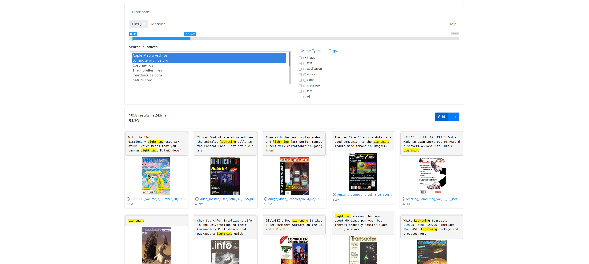

[](https://www.codefactor.io/repository/github/simon987/sist2)
[/statusIcon)](https://files.simon987.net/artifacts/Sist2/Build/)

# sist2

sist2 (Simple incremental search tool)

*Warning: sist2 is in early development*



## Features

* Fast, low memory usage, multi-threaded
* Mobile-friendly Web interface
* Portable (all its features are packaged in a single executable)
* Extracts text from common file types \*
* Generates thumbnails \*
* Incremental scanning
* Automatic tagging from file attributes via [user scripts](scripting/README.md)
* Recursive scan inside archive files \*\*
* OCR support with tesseract \*\*\*


\* See [format support](#format-support)    
\*\* See [Archive files](#archive-files)    
\*\*\* See [OCR](#ocr)    

## Getting Started

1. Have an Elasticsearch (>= 6.X.X) instance running
    1. Download [from official website](https://www.elastic.co/downloads/elasticsearch)
    1. *(or)* Run using docker:
        ```bash
       docker run -d --name es1 --net sist2_net -p 9200:9200 \
            -e "discovery.type=single-node" elasticsearch:7.5.2
        ```
    1. *(or)* Run using docker-compose:
        ```yaml
          elasticsearch:
            image: docker.elastic.co/elasticsearch/elasticsearch:7.5.2
            environment:
              - discovery.type=single-node
              - "ES_JAVA_OPTS=-Xms1G -Xmx2G"
        ```
1. Download sist2 executable
    1. Download the [latest sist2 release](https://github.com/simon987/sist2/releases) *
    1. *(or)* Download a [development snapshot](https://files.simon987.net/artifacts/Sist2/Build/) *(Not recommended!)*
    1. *(or)* `docker pull simon987/sist2:latest`

1. See [Usage guide](USAGE.md)
   

\* *Windows users*: **sist2** runs under [WSL](https://en.wikipedia.org/wiki/Windows_Subsystem_for_Linux)    


## Example usage

See [Usage guide](USAGE.md) for more details

1. Scan a directory: `sist2 scan ~/Documents -o ./docs_idx`
1. Push index to Elasticsearch: `sist2 index ./docs_idx`
1. Start web interface: `sist2 web ./docs_idx`


## Format support

File type | Library | Content | Thumbnail | Metadata
:---|:---|:---|:---|:---
pdf,xps,cbz,cbr,fb2,epub | MuPDF | text+ocr | yes, `png` | title |
`audio/*` | ffmpeg | - | yes, `jpeg` | ID3 tags |
`video/*` | ffmpeg | - | yes, `jpeg` | title, comment, artist |
`image/*` | ffmpeg | - | yes, `jpeg` | [Common EXIF tags](https://github.com/simon987/sist2/blob/efdde2734eca9b14a54f84568863b7ffd59bdba3/src/parsing/media.c#L190) |
ttf,ttc,cff,woff,fnt,otf | Freetype2 | - | yes, `bmp` | Name & style |
`text/plain` | *(none)* | yes | no | - |
tar, zip, rar, 7z, ar ...  | Libarchive | yes\* | - | no |
docx, xlsx, pptx | *(none)* | yes | no | no |

\* *See [Archive files](#archive-files)*
 
### Archive files
**sist2** will scan files stored into archive files (zip, tar, 7z...) as if
they were directly in the file system. Recursive (archives inside archives)
scan is also supported.

**Limitations**:
* Parsing media files with formats that require
*seek* (e.g. `.gif`, `.mp4` w/ fragmented metadata etc.) is not supported.
* Archive files are scanned sequentially, by a single thread. On systems where
**sist2** is not I/O bound, scans might be faster when larger archives are split
 into smaller parts.

To check if a media file can be parsed without *seek*, execute `cat file.mp4 | ffprobe -`
 
 
### OCR

You can enable OCR support for pdf,xps,cbz,cbr,fb2,epub file types with the
`--ocr <lang>` option. Download the language data files with your
package manager (`apt install tesseract-ocr-eng`) or directly [from Github](https://github.com/tesseract-ocr/tesseract/wiki/Data-Files).

The `simon987/sist2` image comes with common languages 
(hin, jpn, eng, fra, rus, spa) pre-installed.

Examples
```bash
sist2 scan --ocr jpn ~/Books/Manga/
sist2 scan --ocr eng ~/Books/Textbooks/
```


## Build from source

You can compile **sist2** by yourself if you don't want to use the pre-compiled
binaries.

1. Install compile-time dependencies

    *(Debian)*
    ```bash
    apt install git cmake pkg-config libglib2.0-dev \
        libssl-dev uuid-dev python3 libmagic-dev libfreetype6-dev \
        libcurl4-openssl-dev libbz2-dev yasm libharfbuzz-dev ragel \
        libarchive-dev libtiff5 libpng16-16 libpango1.0-dev \
        libxml2-dev libopenjp2-7-dev libleptonica-dev
   ```

2. Build
    ```bash
    git clone --recurse-submodules https://github.com/simon987/sist2
    ./scripts/get_static_libs.sh
    cmake .
    make
    ```
