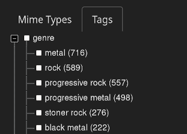

## User scripts

*This document is under construction, more in-depth guide coming soon*

During the `index` step, you can use the `--script-file <script>` option to
modify documents or add user tags. This option is mainly used to
implement automatic tagging based on file attributes.

The scripting language used 
([Painless Scripting Language](https://www.elastic.co/guide/en/elasticsearch/painless/7.4/index.html)) 
is very similar to Java, but you should be able to create user scripts
without programming experience at all if you're somewhat familiar with
regex.

This is the base structure of the documents we're working with:
```json
{
  "_id": "e171405c-fdb5-4feb-bb32-82637bc32084",
  "_index": "sist2",
  "_type": "_doc",
  "_source": {
    "index": "206b3050-e821-421a-891d-12fcf6c2db0d",
    "mime": "application/json",
    "size": 1799,
    "mtime": 1545443685,
    "extension": "md",
    "name": "README",
    "path": "sist2/scripting",
    "content": "..."
  }
}
```

**Example script**

This script checks if the `genre` attribute exists, if it does
it adds the `genre.<genre>` tag. 
```Java
ArrayList tags = ctx._source.tag = new ArrayList();

if (ctx._source?.genre != null) {
    tags.add("genre." + ctx._source.genre.toLowerCase())
}
```

You can use `.` to create a hierarchical tag tree:




To use regular expressions, you need to add this line in `/etc/elasticsearch/elasticsearch.yml`
```yaml
script.painless.regex.enabled: true
```
Or, if you're using docker add `-e "script.painless.regex.enabled=true"`

**Tag color**

You can specify the color for an individual tag by appending an 
hexadecimal color code (`#RRGGBBAA`) to the tag name.

### Examples

If `(20XX)` is in the file name, add the `year.<year>` tag:
```Java
ArrayList tags = ctx._source.tag = new ArrayList();

Matcher m = /[\(\.+](20[0-9]{2})[\)\.+]/.matcher(ctx._source.name);
if (m.find()) {
    tags.add("year." + m.group(1))
}
```

Use default *Calibre* folder structure to infer author.
```Java
ArrayList tags = ctx._source.tag = new ArrayList();

// We expect the book path to look like this:
//  /path/to/Calibre Library/Author/Title/Title - Author.pdf

if (ctx._source.name.contains("-") && ctx._source.extension == "pdf") {
    String[] names = ctx._source.name.splitOnToken('-');
    tags.add("author." + names[1].strip());
}
```

If the file matches a specific pattern `AAAA-000 fName1 lName1, <fName2 lName2>...`, add the `actress.<actress>` and 
`studio.<studio>` tag:
```Java
ArrayList tags = ctx._source.tag = new ArrayList();

Matcher m = /([A-Z]{4})-[0-9]{3} (.*)/.matcher(ctx._source.name);
if (m.find()) {
    tags.add("studio." + m.group(1));

    // Take the matched group (.*), and add a tag for
    //  each name, separated by comma
    for (String name : m.group(2).splitOnToken(',')) {
        tags.add("actress." + name);
    }
}
```

Set the name of the last folder (`/path/to/<studio>/file.mp4`) to `studio.<studio>` tag
```Java
ArrayList tags = ctx._source.tag = new ArrayList();

if (ctx._source.path != "") {
    String[] names = ctx._source.path.splitOnToken('/');
    tags.add("studio." + names[names.length-1]);
}
```

Parse `EXIF:F Number` tag
```Java
if (ctx._source?.exif_fnumber != null) {
    String[] values = ctx._source.exif_fnumber.splitOnToken(' ');
    String aperture = String.valueOf(Float.parseFloat(values[0]) / Float.parseFloat(values[1]));
    if (aperture == "NaN") {
        aperture = "0,0";
    }
    tags.add("Aperture.f/" + aperture.replace(".", ","));
}
```

Display year and months from `EXIF:DateTime` tag
```Java
if (ctx._source?.exif_datetime != null) {
    SimpleDateFormat parser = new SimpleDateFormat("yyyy:MM:dd HH:mm:ss");
    Date date = parser.parse(ctx._source.exif_datetime);

    SimpleDateFormat yp = new SimpleDateFormat("yyyy");
    SimpleDateFormat mp = new SimpleDateFormat("MMMMMMMMM");

    String year = yp.format(date);
    String month = mp.format(date);

    tags.add("Month." + month);
    tags.add("Year." + year);
}

```
